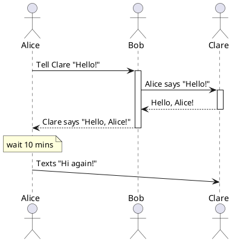

# TODO DIAGRAM NAME
> Replace this blockquote with a description of the diagram

# Primary Representation
<!--
    Define PlantUML diagrams in .puml files, and then add MD comments, similar to the one below to have the images
    added and rendered in the doc
-->

# Element Catalog
<!-- Fill out the below sections with any relevant information or N/A -->

## Elements and their properties
|Element Name|Description|Properties|Notes|
|------------|-----------|----------|-----|
| Alice | An example actor in the exchange of information. | <ul> <li>Age: 20 years old</li> </ul> | N/A |
| Bob | The intermediary for communicating between Alice and Clare. | <ul> <li>Age: 21 years old</li> </ul> | N/A
| Clare | TODO | TODO | TODO |

## Element Interfaces
TODO(?) - probably links to Swagger/GraphQL/AsyncAPI specs?

## Element Behavior
Maybe?

# Context Diagram
<!-- Probably want to create a reusable context diagram that can be pulled in here -->
<!--  -->

# Variability Guide

# Design Rationale
TODO

# Related Views
TODO
