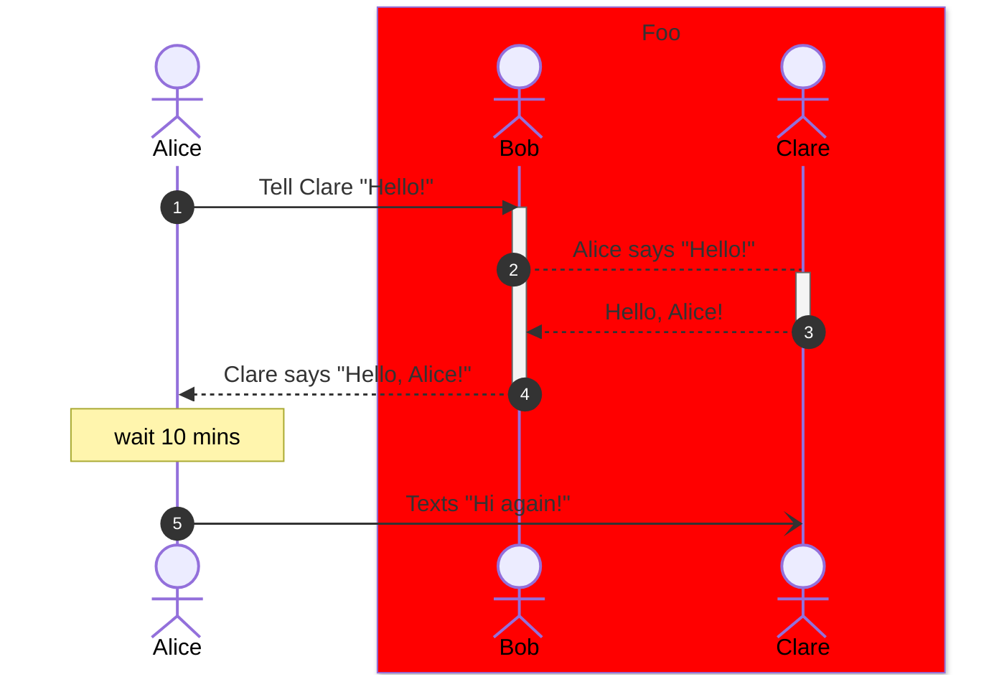

# TODO DIAGRAM NAME
This template is inspired by the ["Software Architecture View" template](https://wiki.sei.cmu.edu/confluence/display/SAD/Views) from the Software Engineer Institute's [_Documenting Software Architectures_ course](https://www.sei.cmu.edu/education-outreach/courses/course.cfm?coursecode=V18)at Carnegie Mellon University.
> Replace this blockquote with a description of the diagram

# Primary Representation

# Element Catalog
<!-- Fill out the below sections with any relevant information or N/A -->

## Elements and their properties
|Element Name|Description|Properties|Notes|
|------------|-----------|----------|-----|
| Alice | An example actor in the exchange of information. | <ul> <li>Age: 20 years old</li> </ul> | N/A |
| Bob | The intermediary for communicating between Alice and Clare. | <ul> <li>Age: 21 years old</li> </ul> | N/A
| Clare | TODO | TODO | TODO |

## Element Interfaces
TODO(?) - probably links to Swagger/GraphQL/AsyncAPI specs?

## Element Behavior
TODO - figure out what makes sense to include

# Context Diagram
<!-- Probably want to create a reusable context diagram that can be pulled in here -->
<!--  -->

# Variability Guide

# Design Rationale
TODO

# Related Views
TODO
